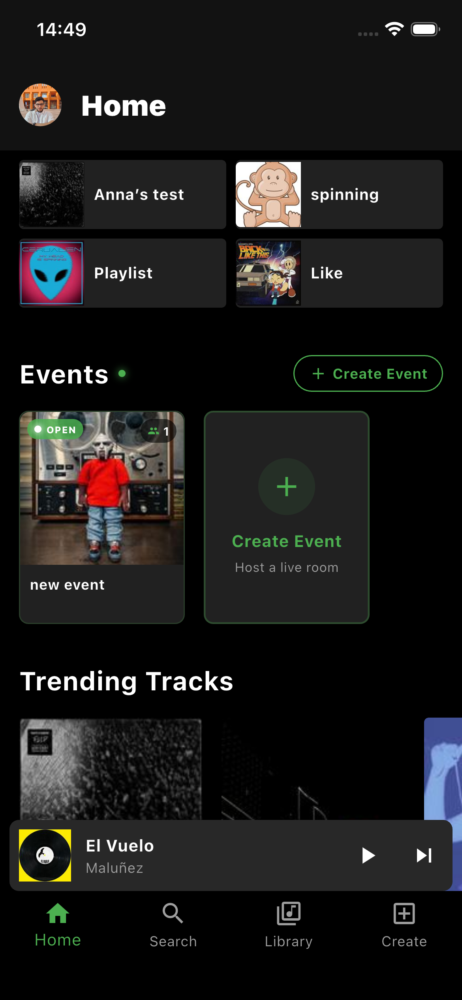
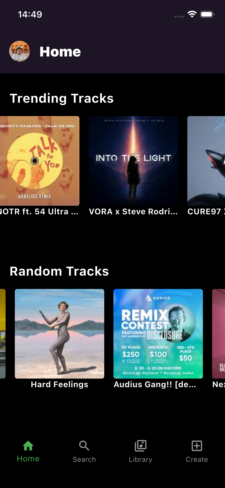
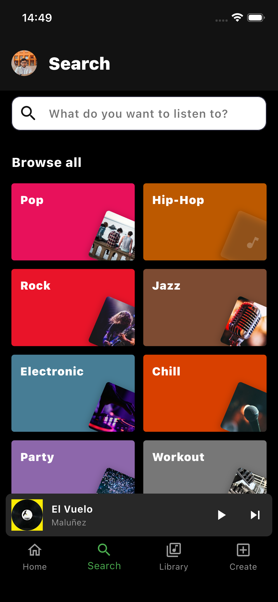
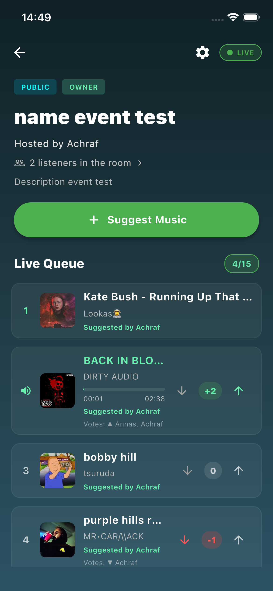
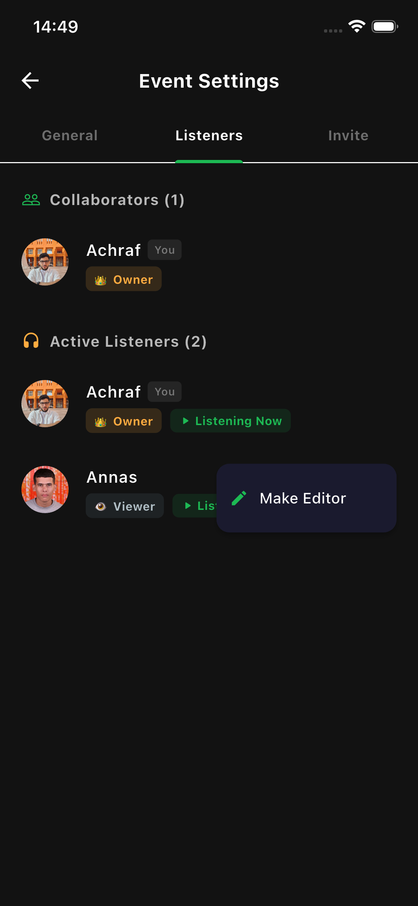
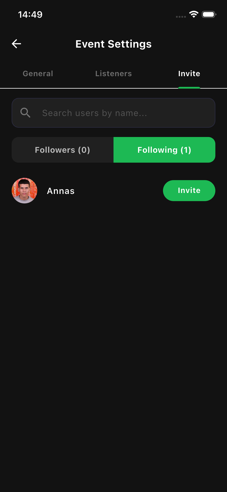
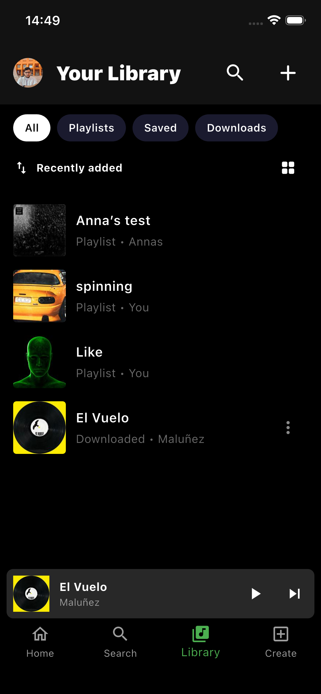
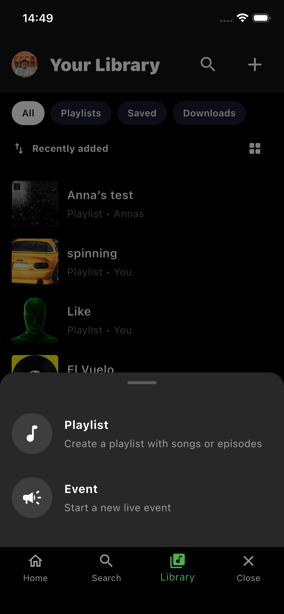
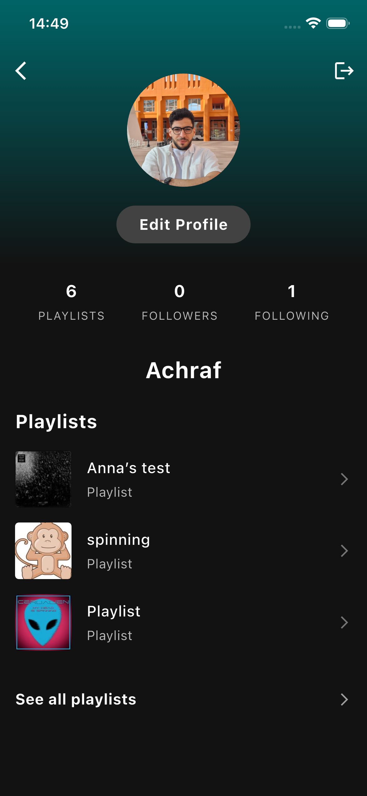
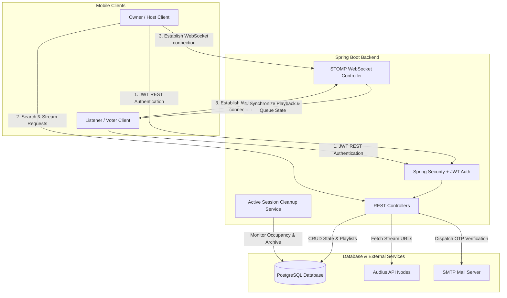

# 🎵 MusicRoom

[](https://flutter.dev)
[](https://spring.io/projects/spring-boot)
[](https://www.postgresql.org)
[](https://openjdk.org)
[](LICENSE)

**MusicRoom** is a premium, high-fidelity, real-time collaborative music streaming and sharing platform. Built with a robust **Spring Boot (Java 21)** backend and a beautiful, theme-aware **Flutter** mobile client, it empowers users to host live music rooms, collaborate on playlists with friends, vote on upcoming tracks, and stream high-quality audio in perfect synchronization. 

---

## 📱 Visual Showcase

Explore the stunning, theme-aware user interface designed for maximum engagement, high-performance interactions, and modern design aesthetics.

### 🏠 The Core Hub & Music discovery
Discover popular music, jump back into your curated library, or find active live sessions directly from the landing dashboard.

<table width="100%">
  <tr>
    <td width="33%" align="center">
      <b>Home Feed</b><br/>
      
      <br/><i>Access trending tracks, personal playlists, and ongoing live events in one dynamic view.</i>
    </td>
    <td width="33%" align="center">
      <b>Trending Tracks</b><br/>
      
      <br/><i>Explore viral global hits and immediately listen to high-quality audio.</i>
    </td>
    <td width="33%" align="center">
      <b>Decentralized Search</b><br/>
      
      <br/><i>Instant, fuzzy track searching powered by the Audius music catalog.</i>
    </td>
  </tr>
</table>

### 👥 Collaboration & Live Rooms
Host collaborative parties, manage listener capabilities, and invite friends to enjoy synchronized music.

<table width="100%">
  <tr>
    <td width="33%" align="center">
      <b>Live Music Room</b><br/>
      
      <br/><i>Stream in real-time, vote on the queue, and suggest new tracks collaboratively.</i>
    </td>
    <td width="33%" align="center">
      <b>Collaborator Permissions</b><br/>
      
      <br/><i>Assign roles dynamically (Owner, Editor, Voter) to manage playback and suggestions.</i>
    </td>
    <td width="33%" align="center">
      <b>Invite Friends</b><br/>
      
      <br/><i>Quickly search for registered platform users and add them to your collaborative rooms.</i>
    </td>
  </tr>
</table>

### ⚙️ Library, Configuration & Settings
Organize your spaces, update privacy preferences, and custom tailor your identity.

<table width="100%">
  <tr>
    <td width="33%" align="center">
      <b>Your Library</b><br/>
      
      <br/><i>A unified dashboard displaying all playlists you own or collaborate on.</i>
    </td>
    <td width="33%" align="center">
      <b>Create Playlist or Event</b><br/>
      
      <br/><i>Instantly initialize a shared music playlist or launch a public/private live party.</i>
    </td>
    <td width="33%" align="center">
      <b>User Profile</b><br/>
      
      <br/><i>Manage personal information, accounts, active states, and custom themes.</i>
    </td>
  </tr>
</table>

---

## ✨ Key Features

*   **⚡ Real-time Synchronization**: Powered by standard STOMP WebSockets, the playback state (Play, Pause, Skip, Seek) is synchronized in real-time across all active event listeners.
*   **🔒 Granular Role-Based Access Control**:
    *   **Owner**: Has absolute authority, controls track suggestions, alters settings, changes collaborator permissions, and manages playback.
    *   **Editor**: Can suggest music, upvote/downvote tracks, and help manage the live queue.
    *   **Voter/Listener**: Listens to the synchronized stream, and votes on tracks.
*   **🎨 Decentralized Audio Engine**: Seamlessly searches and streams millions of tracks using the decentralized **Audius API**, keeping dependencies on centralized databases completely light.
*   **🛡️ Robust Authentication & Security**:
    *   Secure local password signups verified through **One-Time Passwords (OTP)** dispatched via Spring Mail.
    *   Stateless **JWT authentication** using secure HttpOnly/Bearer header authorization, accompanied by a double-token access & refresh security rotation mechanism.
    *   **Google Sign-In integration** verifying ID tokens directly on the backend to authenticate or auto-register users safely.
*   **♻️ Live Event Auto-Cleanup**: Smart background routines automatically terminate and clean up event rooms when listener counts hit zero, keeping database records clean and preventing zombie connections.
*   **🔄 Pull-to-Refresh Support**: Seamlessly refresh active rooms, personal playlists, and trending tracks with simple swipe gestures.

---

## 🛠️ Tech Stack

### Backend Architecture
*   **Core**: Java 21, Spring Boot 3.3.5
*   **Security**: Spring Security, JWT (JSON Web Tokens), OAuth2 Client
*   **Database & Persistence**: PostgreSQL, Spring Data JPA, Hibernate, PostgreSQL LOB (Large Objects)
*   **Real-time Services**: Spring WebSockets with STOMP protocol
*   **Communication**: Spring Mail (Secure SMTP for verification and recovery codes)
*   **Documentation**: Springdoc OpenAPI / Swagger UI

### Mobile Application
*   **Core**: Dart, Flutter SDK (Targeting Android, iOS, and Web)
*   **State Management**: Provider (Listening to explicit auth, playlist, and event state changes)
*   **Networking & Socket Clients**: HTTP client with Bearer Interceptors, Stomp Dart Client for persistent real-time socket connections
*   **Audio Engines**: `just_audio` and `audioplayers` for low-latency decentralized streaming and local asset controls
*   **Persistence**: `shared_preferences` for encrypted secure local user session storage

---

## 📐 System Architecture

The following Mermaid diagram visualizes the communication architecture of MusicRoom, showing how mobile clients coordinate through HTTP REST and WebSockets with the backend:



---

## 🚀 Getting Started

### Prerequisites
*   **Java Development Kit (JDK)**: version 21
*   **Maven**: version 3.9+ (or use the packaged Maven wrapper `./mvnw`)
*   **PostgreSQL**: version 15+
*   **Flutter SDK**: version 3.11+
*   **SMTP Credentials**: A working Gmail/SMTP server to send OTP emails.

---

### 1. Backend Configuration & Setup

1. **Clone the repository**:
   ```bash
   git clone https://github.com/your-username/MusicRoom-App.git
   cd MusicRoom-App/backend/musicroom
   ```

2. **Configure environment variables**:
   Create a `.env` file in `backend/musicroom/` (use the provided `.env` template as reference):
   ```env
   # PostgreSQL Settings
   DB_URL=jdbc:postgresql://localhost:5432/musicroom
   DB_USERNAME=postgres
   DB_PASSWORD=your_secure_password

   # JWT Properties
   JWT_SECRET=your_super_secret_jwt_signing_key_must_be_long_enough_to_be_secure_256_bits
   JWT_EXPIRATION=86400000 # 24 Hours (milliseconds)
   JWT_REFRESH_EXPIRATION=604800000 # 7 Days (milliseconds)

   # Mail/SMTP Settings
   SPRING_MAIL_HOST=smtp.gmail.com
   SPRING_MAIL_PORT=587
   SPRING_MAIL_USERNAME=your_email@gmail.com
   SPRING_MAIL_PASSWORD=your_app_specific_gmail_password

   # Google Authentication Credentials
   GOOGLE_WEB_CLIENT_ID=your-google-web-client-id.apps.googleusercontent.com
   GOOGLE_IOS_CLIENT_ID=your-google-ios-client-id.apps.googleusercontent.com
   ```

3. **Initialize Database**:
   Create a PostgreSQL database named `musicroom`:
   ```sql
   CREATE DATABASE musicroom;
   ```

4. **Run the Backend Application**:
   Execute the Spring Boot Maven wrapper to start the server locally:
   ```bash
   ./mvnw spring-boot:run
   ```
   The backend server will bootstrap and start listening on port `8080`.
   *   **Swagger API Docs**: Access [http://localhost:8080/swagger-ui/index.html](http://localhost:8080/swagger-ui/index.html) to interact with live documentation.

---

### 2. Mobile Configuration & Setup

1. **Navigate to the mobile app directory**:
   ```bash
   cd ../../mobile
   ```

2. **Configure Flutter Environment**:
   Create a `.env` file inside the `mobile/` directory:
   ```env
   # Backend API Endpoint
   # Use localhost for iOS simulator, or 10.0.2.2 for Android Emulator
   API_URL=http://localhost:8080
   
   # WebSocket Connection Endpoint
   # Use ws://localhost:8080/ws for iOS simulator, or ws://10.0.2.2:8080/ws for Android
   WS_URL=ws://localhost:8080/ws

   # Google Auth IDs (must match the backend parameters)
   GOOGLE_WEB_CLIENT_ID=your-google-web-client-id.apps.googleusercontent.com
   GOOGLE_IOS_CLIENT_ID=your-google-ios-client-id.apps.googleusercontent.com
   ```

3. **Fetch Flutter packages**:
   ```bash
   flutter pub get
   ```

4. **Verify Connected Devices**:
   Ensure you have a simulator running (iOS Simulator or Android Emulator) or a physical developer device connected:
   ```bash
   flutter devices
   ```

5. **Run the Application**:
   ```bash
   flutter run
   ```

---

## 👥 Authors & Contributions

This application is fully open source. Feel free to open issues or submit Pull Requests for any feature upgrades or bug resolutions! 

*   Developed by:
    *   **Achraf Ahrach**
    *   **Anas Bouzanbil**
    *   **Aboubaker Fanti**
    *   **Hamad Oubeid**
*   Special thanks to the **Audius Developer Platform** for open-access music streaming and catalog nodes.

---
